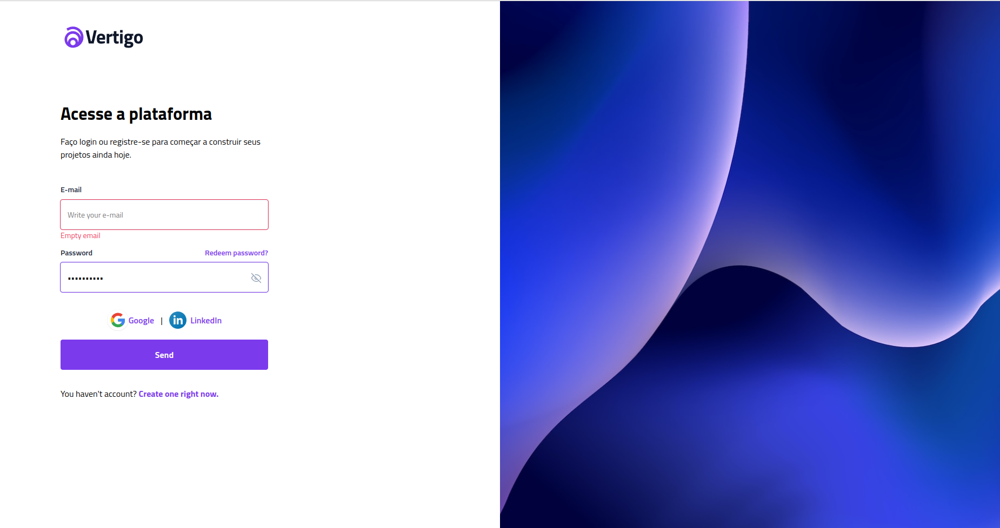

<h1 align="center"> Social Login </h1>

  Mais um projeto do Bora Codar que utilizei para melhorar minhas habilidades com CSS.

  <a href="#tecnologies">Tecnologias</a>&nbsp;&nbsp;&nbsp;|&nbsp;&nbsp;&nbsp;
  <a href="#project">Projeto</a>&nbsp;&nbsp;&nbsp;|&nbsp;&nbsp;&nbsp;
    <a href="#orientações">Orientações</a>&nbsp;&nbsp;&nbsp;|&nbsp;&nbsp;&nbsp;
  <a href="#desafios">Desafios</a>&nbsp;&nbsp;&nbsp;|&nbsp;&nbsp;&nbsp;
  <a href="#extres">Extras</a>&nbsp;&nbsp;&nbsp;|&nbsp;&nbsp;&nbsp;
  <a href="#memo-licença">Licença</a>

  

 

  

## 🚀 Tecnologias

 Esse projeto foi desenvolvido com as seguintes tecnologias: 

- HTML e CSS.

## 💻 Projeto

 Este desafio faz parte da série "Bora Codar" da Rockeseat. Desta vez me desafiei a realizar uma tela de login e implementar algo diferente além do desafio proposto.

## 🗺️ Orientações

<ul id="orientations">
  <li> Apenas tenha em seu VS Code a extensão "Live Server" que é sucesso.</li>
</ul>

## ⚔️ Desafios enfrentados

 O desafio que tive foi simplesmente fazer com que ícone de exibir/esconder senha funcionasse em diferentes telas sem que se distorcesse.

## 🧑‍🔧 Extras

 
  Algumas Melhorias que podem ser feitas por eu ou até mesmo por você caso queira no futuro:

  <ul style="margin-left: 20px">
      <li> Implementar "Logins Sociais". </li>
      <li> Implementar SASS. </li>
  </ul>

## Licença

Esse projeto está sob a licença MIT.